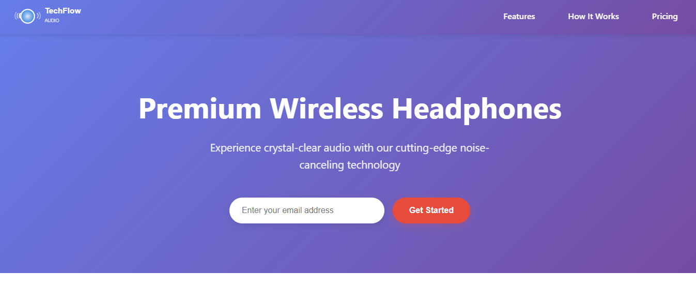

# 🚀 Shibam Banerjee - TechFlow Product Landing Page


A modern, responsive product landing page for TechFlow Premium Wireless Headphones. This landing page features a sleek design with interactive elements, product showcase, pricing plans, and customer testimonials to drive conversions and sales.

## 📸 Screenshots

<div align="center">
  
  <p><em>Modern product landing page with premium wireless headphones showcase</em></p>
</div>

## ✨ Live Demo

🌐 **[View Live Demo](https://your-live-demo-link.com)** *(Update after deployment)*

## 🚀 Key Features

- **🎨 Premium Design**: Modern and sleek product-focused layout
- **📱 Fully Responsive**: Mobile-first design optimized for all devices
- **🎧 Product Showcase**: Interactive product gallery with detailed specifications
- **💰 Pricing Section**: Clear pricing plans with feature comparisons
- **⭐ Customer Reviews**: Testimonials and social proof section
- **📧 Email Subscription**: Newsletter signup with form validation
- **🎭 Smooth Animations**: CSS transitions and scroll-triggered effects
- **🔍 SEO Optimized**: Proper meta tags and semantic HTML structure
- **♿ Accessibility**: WCAG compliant with proper ARIA labels
- **⚡ Fast Loading**: Optimized images and efficient code structure

## 🎨 Design System

### Color Palette
- **Primary**: Deep blues and tech-inspired gradients
- **Accent**: Bright highlights for call-to-action buttons
- **Background**: Clean whites with subtle gradients
- **Text**: High contrast for optimal readability

### Typography
- **Headings**: Bold, modern sans-serif fonts
- **Body Text**: Clean and readable typography
- **Product Info**: Highlighted specifications and features

## 📱 Sections

1. **🏠 Header** - Navigation and hero section with main product
2. **🎧 Features** - Key product features and benefits
3. **📊 Specifications** - Detailed technical specifications
4. **💰 Pricing** - Pricing plans and purchase options
5. **⭐ Testimonials** - Customer reviews and social proof
6. **📞 Contact** - Contact information and support

## 🛠️ Tech Stack

- **⚡ Frontend**: HTML5, CSS3, JavaScript (ES6+)
- **🎨 Styling**: Custom CSS with Flexbox and Grid
- **🎭 Animations**: CSS transitions and JavaScript interactions
- **📱 Responsive**: Mobile-first design approach
- **🔍 SEO**: Semantic HTML and meta tags
- **♿ Accessibility**: WCAG 2.1 guidelines

## 🚀 Getting Started

### Prerequisites

- Web browser (Chrome, Firefox, Safari, Edge)
- Text editor (VS Code, Sublime Text, etc.)
- Basic knowledge of HTML, CSS, and JavaScript

### Installation

1. **Clone the repository**
   ```bash
   git clone https://github.com/Shibam-Code-Pro/product-landing-page.git
   cd product-landing-page
   ```

2. **Open the project**
   ```bash
   # Simply open index.html in your browser
   open index.html
   # or
   start index.html
   ```

3. **For development**
   - Use a local server like Live Server extension in VS Code
   - Or use Python's built-in server: `python -m http.server 8000`

## 📁 Project Structure

```
product-landing-page/
├── 📄 index.html              # Main HTML file
├── 🎨 styles.css              # CSS styles and animations
├── ⚡ script.js               # JavaScript functionality
├── 📸 screenshot/             # Project screenshots
│   └── product-landing-page.png
├── 📖 README.md               # Project documentation
├── 📜 LICENSE                 # MIT License
└── 🚫 .gitignore              # Git ignore rules
```

## 🛠️ Technologies Used

<table>
<tr>
<td align="center"><br><b>HTML5</b></td>
<td align="center"><br><b>CSS3</b></td>
<td align="center"><br><b>JavaScript</b></td>
<td align="center"><br><b>Git</b></td>
<td align="center"><br><b>VS Code</b></td>
</tr>
</table>

## 🎯 Customization Guide

### Updating Product Information

1. **Product Details**: Update product name, description, and features in `index.html`
2. **Pricing**: Modify pricing plans and features in the pricing section
3. **Images**: Replace product images with your own
4. **Testimonials**: Add real customer reviews and testimonials

### Styling Customization

1. Open `styles.css`
2. Modify CSS custom properties for brand colors
3. Update fonts and typography to match brand guidelines
4. Adjust layouts and spacing as needed

### Adding New Features

1. Add new sections in `index.html`
2. Create corresponding CSS styles in `styles.css`
3. Add JavaScript functionality in `script.js` if needed
4. Update navigation and internal links

## 🌐 Deployment

### 🚀 Quick Deploy Options

1. **GitHub Pages**
   - Push to GitHub repository
   - Enable GitHub Pages in repository settings
   - Access via `https://username.github.io/repository-name`

2. **Netlify**
   - Drag and drop project folder to Netlify
   - Get instant live URL with form handling
   - Automatic HTTPS and CDN

3. **Vercel**
   - Import GitHub repository
   - Deploy with zero configuration
   - Perfect for static landing pages

### 🔧 Pre-Deployment Checklist

- ✅ Test all interactive elements and forms
- ✅ Verify responsive design on all devices
- ✅ Check call-to-action buttons and links
- ✅ Optimize images for web performance
- ✅ Update live demo URL in README

## 📊 Performance Features

- **Image Optimization**: Compressed product images for faster loading
- **CSS Optimization**: Efficient stylesheets and animations
- **JavaScript Optimization**: Minimal and clean code
- **SEO**: Product-focused meta tags and structured data
- **Accessibility**: Screen reader compatible with proper labels

## 🎯 Special Features

### 🎧 Product Showcase
- Interactive product gallery
- Detailed specifications display
- Feature highlight animations

### 💰 Pricing Plans
- Clear pricing comparison
- Feature-based plan differentiation
- Call-to-action optimization

### 📧 Email Capture
- Newsletter subscription form
- Form validation and user feedback
- Lead generation optimization

## 📝 License

This project is open source and available under the [MIT License](LICENSE).

## 🤝 Contributing

Contributions, issues, and feature requests are welcome! Feel free to check the [issues page](https://github.com/Shibam-Code-Pro/product-landing-page/issues).

## 📞 Contact

**Shibam Banerjee**
- Email: Connect-With-Shibam@outlook.com
- Phone: +91 62902-18960
- LinkedIn: [linkedin.com/in/shibam-webdev](https://linkedin.com/in/shibam-webdev)
- GitHub: [github.com/Shibam-Code-Pro](https://github.com/Shibam-Code-Pro)

## 🙏 Acknowledgments

- [HTML5](https://developer.mozilla.org/en-US/docs/Web/HTML) for semantic structure
- [CSS3](https://developer.mozilla.org/en-US/docs/Web/CSS) for modern styling
- [JavaScript](https://developer.mozilla.org/en-US/docs/Web/JavaScript) for interactivity
- [Font Awesome](https://fontawesome.com/) for icons
- [Unsplash](https://unsplash.com/) for product images

---

⭐ **If you found this project helpful, please give it a star!** ⭐
